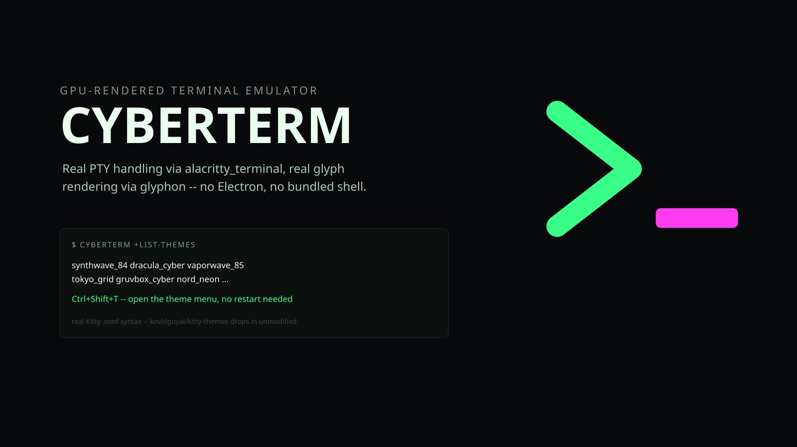

<p align="center"></p>

# 📟 cyberterm

[](https://github.com/darkstardevx/cyberterm/actions/workflows/ci.yml)
[](https://github.com/darkstardevx/cyberterm/actions/workflows/release.yml)

`Rust` · `wgpu` · `alacritty_terminal` · `glyphon`

**A GPU-rendered terminal emulator.** Real PTY handling via
`alacritty_terminal`, real glyph rendering via `glyphon` (cosmic-text +
etagere on a wgpu pipeline), 12 built-in Kitty-format themes, and a
in-terminal theme menu — no Electron, no bundled shell.

**[darkstardevx.github.io/cyberterm](https://darkstardevx.github.io/cyberterm/)**

## 📦 Install

```bash
curl -fsSL https://raw.githubusercontent.com/darkstardevx/cyberterm/main/install.sh | sh
```

Downloads the latest release for your platform (Linux or macOS, x86_64
or aarch64), verifies its SHA-256 checksum, and installs `cyberterm` to
`~/.local/bin`. Linux needs the usual desktop GL/X11/Wayland libraries
already present — nothing extra to install for the binary itself. Or
build from source with `cargo build --release`.

## 🚀 Commands

```bash
cyberterm                     # launch the terminal
cyberterm +list-themes        # list every theme found in ~/.config/cyberterm/themes
cyberterm +set-theme <name>   # switch theme and save it as the default
cyberterm +edit-theme --create-theme <category> <folder> <name>
cyberterm +edit-theme --view-theme <category> <folder> <name>
cyberterm +edit-theme --remove-theme <category> <folder> <name>
cyberterm +set-opacity --custom=0.85
cyberterm +list-termkeys
```

12 curated Kitty-syntax themes ship built-in (`~/.config/cyberterm/themes/*.conf`)
and load unmodified — anything pulled straight from
[kovidgoyal/kitty-themes](https://github.com/kovidgoyal/kitty-themes) drops in
next to them with zero conversion. `+edit-theme` writes your own custom
themes as JSON under a `category/folder/` layout alongside the built-ins;
the theme registry reads both shapes at startup. Press `Ctrl+Shift+T` in
the terminal itself to open the same theme picker without leaving the
session.

## ⚙️ Rendering

Text is drawn by `glyphon` (cosmic-text shaping + etagere glyph atlas) on
a wgpu render pipeline; per-cell background color (selection highlights,
`ls --color` entries, etc.) is a separate hand-rolled quad pass, since
glyphon only rasterizes glyphs. Window opacity (`+set-opacity`) fades
cell backgrounds only — text stays fully opaque, matching how
Ghostty/Kitty/Alacritty do transparency.

## 🗺 Known limitations

- **Paste isn't wired up.** Copy (mouse selection, or an app inside the
  terminal writing an OSC 52 clipboard-set sequence) works and goes to
  the system clipboard. Reading the system clipboard back — a keybinding
  paste, or an app's OSC 52 clipboard-*read* query — currently returns
  empty. Worth knowing before you rely on it for a paste-heavy workflow.
- No tabs, no split panes. One window, one PTY session.
- No syntax highlighting inside the terminal buffer itself (that's a
  shell/pager/editor concern, not a terminal emulator's).

## 🚦 Quality gate

```bash
./scripts/release-gates quick   # fmt + check + clippy
./scripts/release-gates full    # quick + tests + strict rustdoc
```

See [`CONTRIBUTING.md`](CONTRIBUTING.md) for what each step checks and why
the render/PTY/input path can't be covered by automated tests.

## ⚖️ Namespace & Legal Attribution

This project is an independent component of the **Cybercore Systems Framework** hosted canonically at [darkstardevx.github.io](https://darkstardevx.github.io/).

**Copyright (c) 2026 Cybercore Tech (darkstardevx.github.io)**

Permission is hereby granted, free of charge, to any person obtaining a copy of this software and associated documentation files (the "Software"), to deal in the Software without restriction, including without limitation the rights to use, copy, modify, merge, publish, distribute, sublicense, and/or sell copies of the Software, and to permit persons to whom the Software is furnished to do so, subject to the following conditions:

The above copyright notice and this permission notice shall be included in all copies or substantial portions of the Software.

THE SOFTWARE IS PROVIDED "AS-IS", WITHOUT WARRANTY OF ANY KIND, EXPRESS OR IMPLIED, INCLUDING BUT NOT LIMITED TO THE WARRANTIES OF MERCHANTABILITY, FITNESS FOR A PARTICULAR PURPOSE AND NONINFRINGEMENT. IN NO EVENT SHALL THE AUTHORS OR COPYRIGHT HOLDERS BE LIABLE FOR ANY CLAIM, DAMAGES OR OTHER LIABILITY, WHETHER IN AN ACTION OF CONTRACT, TORT OR OTHERWISE, ARISING FROM, OUT OF OR IN CONNECTION WITH THE SOFTWARE OR THE USE OR OTHER DEALINGS IN THE SOFTWARE.

### 🛡️ Defensive Guardrail Statement

All software components, tools, prefixes, and configurations under the "Cyber" prefix within this ecosystem are developed completely independently as open-source utilities for specialized terminal environments. They maintain absolutely no affiliation, partnership, endorsement, sponsorship, or commercial connection with any external corporate cybersecurity providers, training collectives, or federal defense contractors. Prior art is formally registered and maintained immutably via active domain publication.

**Contact:** [cybercore.sh+cyberterm@gmail.com](mailto:cybercore.sh+cyberterm@gmail.com) // [darkstardevx.github.io](https://darkstardevx.github.io/)
